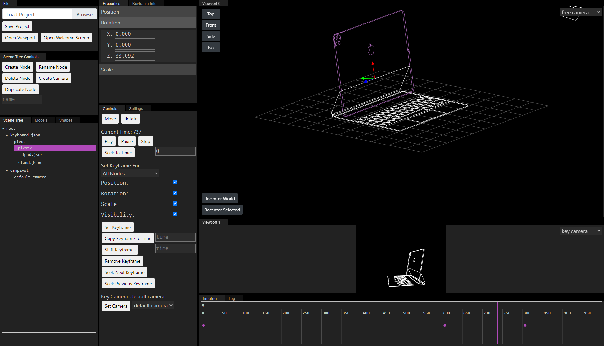

Create 3D animations in the browser. Requires WebGL

Use the editor:
[https://minkcv.github.io/keyframe3d/](https://minkcv.github.io/keyframe3d/)

View the demos:
[https://minkcv.github.io/keyframe3d/demos/](https://minkcv.github.io/keyframe3d/demos/)

Read the documentation [/docs](https://github.com/minkcv/keyframe3d/tree/master/docs)

### Licensing
You retain the rights to any animations that you create, but keep in mind that the animation data distributed with the player is the same data used by the edtior so anyone can load and modify it.